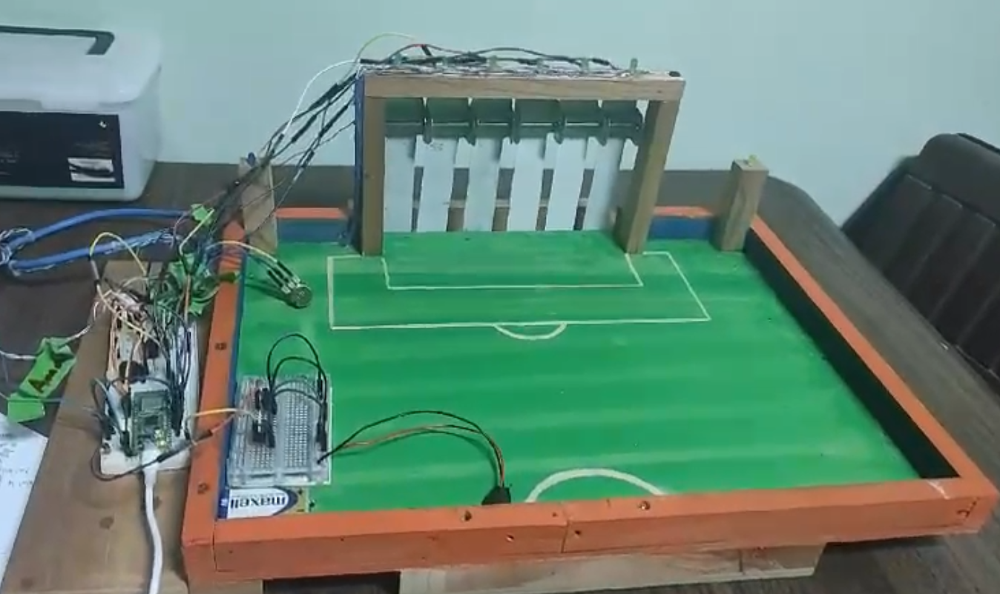

Indicaciones

##################################################################################################

Se trabaja con Python version Python 3.12.3

El programa de Thonny se ejecuta con el interprete  de  CircuitPyhton

##################################################################################################

